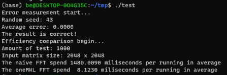

# FFT Using Intel oneAPI ·   

This is the source code of Intel oneAPI Hackathon Competition in 2023. This project is to show the performance of Intel oneAPI FFT compared to the naive FFT implementation.

## Environment 
+ OS: Ubuntu 20.04 LTS
+ Hardware: should meet [Intel oneAPI DPC++/C++ compiler system requirements](https://www.intel.com/content/www/us/en/developer/articles/system-requirements/intel-oneapi-dpcpp-system-requirements.html)

## Quickstart
1. Download and install the [Intel oneAPI Base Toolkit](https://www.intel.com/content/www/us/en/developer/tools/oneapi/base-toolkit-download.html?operatingsystem=linux&distributions=offline&version=2023.2.0) (or you can only download and install the [Intel oneMKL](https://www.intel.com/content/www/us/en/developer/tools/oneapi/onemkl-download.html?operatingsystem=linux&distributions=offline) when you have installed Intel oneAPI DPC++/C++ Compiler)
2. Set up the environment variables of Intel oneAPI DPC++/C++ Compiler. Generally, you can use the command line instruction 
    
    ```source /path/to/oneapi/setvars.sh ```
3. Make sure you can call the `icx` command.
4. Compile the main.c file

    ```icx main.c -lmkl_rt -o test```
5. Run the executable flle ```./test```, and wait for a while (about 20 minutes), you will get the result like this.

    

## Tips
Here's the part where I want to share some problems I meet during developing this project.
1. When you try to use oneAPI to do the FFT, you may follow the official [FFT Code Examples](https://www.intel.com/content/www/us/en/docs/onemkl/developer-reference-c/2023-0/fft-code-examples.html). However, if it is the In-place FFT that you use, you may get a full-zero output. If that happen, please use the Out-of-place FFT, which means you should add a code line before you compute the FFT:

    `status = DftiSetValue(my_desc_handle, DFTI_PLACEMENT, DFTI_NOT_INPLACE);` 
2. There are lots of data formats to pack the FFT output in oneAPI, you may find them all [here](https://www.intel.com/content/www/us/en/docs/onemkl/developer-reference-c/2023-0/dfti-packed-format.html#GUID-F65C2255-963E-429F-9E74-99DFBCE1526F). However, none of the official codes here to unpack the format is correct. You should follow the code example in `/path/to/oneapi/mkl/latest/examples/examples_core_c.tgz` to unpack the output.